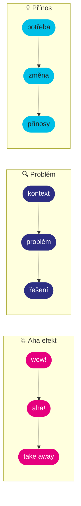

# Postav srozumitelnou strukturu
---
layout: default
---
# Postav srozumitelnou strukturu

```mermaid
graph LR
    subgraph s1["💥 Aha efekt"]
      direction TB
      A1([wow!]) --> B1([aha!]) --> C1([take away])
    end
    subgraph s2["🔍 Problém"]
      direction TB
      A2([kontext]) --> B2([problém]) --> C2([řešení])
    end
    subgraph s3["💡 Přínos"]
      direction TB
      A3([potřeba]) --> B3([změna]) --> C3([přínosy])
    end
    style A1 fill:#E6007E,stroke:none,color:#fff
    style B1 fill:#E6007E,stroke:none,color:#fff
    style C1 fill:#E6007E,stroke:none,color:#fff
    style A2 fill:#2D2E83,stroke:none,color:#fff
    style B2 fill:#2D2E83,stroke:none,color:#fff
    style C2 fill:#2D2E83,stroke:none,color:#fff
    style A3 fill:#00BFE7,stroke:none,color:#222
    style B3 fill:#00BFE7,stroke:none,color:#222
    style C3 fill:#00BFE7,stroke:none,color:#222
```
