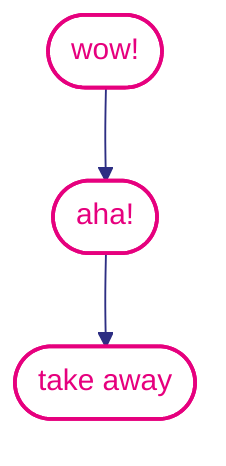
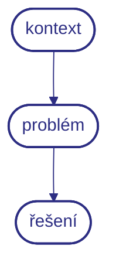
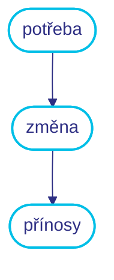

# Postav srozumitelnou strukturu

  

    <h3>💥 Aha efekt</h3>

```mermaid
%%{init: {'theme':'base','themeVariables': {'primaryColor':'#ffffff','primaryTextColor':'#2D2E83','primaryBorderColor':'#2D2E83','lineColor':'#2D2E83','secondaryColor':'#ffffff','tertiaryColor':'#ffffff','background':'#ffffff'}}}%%
graph TD
  A([wow!]) --> B([aha!]) --> C([take away])
  style A fill:#ffffff,stroke:#E6007E,color:#E6007E,stroke-width:2px
  style B fill:#ffffff,stroke:#E6007E,color:#E6007E,stroke-width:2px
  style C fill:#ffffff,stroke:#E6007E,color:#E6007E,stroke-width:2px
```
  

  

    <h3>🔍 Problém</h3>

```mermaid
%%{init: {'theme':'base','themeVariables': {'primaryColor':'#ffffff','primaryTextColor':'#2D2E83','primaryBorderColor':'#2D2E83','lineColor':'#2D2E83','secondaryColor':'#ffffff','tertiaryColor':'#ffffff','background':'#ffffff'}}}%%
graph TD
  A([kontext]) --> B([problém]) --> C([řešení])
  style A fill:#ffffff,stroke:#2D2E83,color:#2D2E83,stroke-width:2px
  style B fill:#ffffff,stroke:#2D2E83,color:#2D2E83,stroke-width:2px
  style C fill:#ffffff,stroke:#2D2E83,color:#2D2E83,stroke-width:2px
```
  

  

    <h3>💡 Přínos</h3>

```mermaid
%%{init: {'theme':'base','themeVariables': {'primaryColor':'#ffffff','primaryTextColor':'#2D2E83','primaryBorderColor':'#2D2E83','lineColor':'#2D2E83','secondaryColor':'#ffffff','tertiaryColor':'#ffffff','background':'#ffffff'}}}%%
graph TD
  A([potřeba]) --> B([změna]) --> C([přínosy])
  style A fill:#ffffff,stroke:#00BFE7,color:#2D2E83,stroke-width:2px
  style B fill:#ffffff,stroke:#00BFE7,color:#2D2E83,stroke-width:2px
  style C fill:#ffffff,stroke:#00BFE7,color:#2D2E83,stroke-width:2px
```
  

