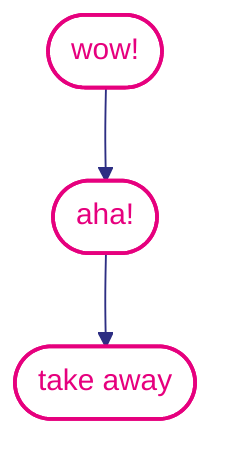
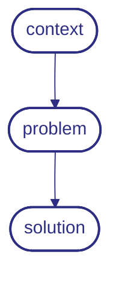
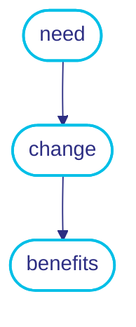

# Build a Clear Structure

  

    <h3>💥 The Aha Effect</h3>

```mermaid
%%{init: {'theme':'base','themeVariables': {'primaryColor':'#ffffff','primaryTextColor':'#2D2E83','primaryBorderColor':'#2D2E83','lineColor':'#2D2E83','secondaryColor':'#ffffff','tertiaryColor':'#ffffff','background':'#ffffff'}}}%%
graph TD
  A([wow!]) --> B([aha!]) --> C([take away])
  style A fill:#ffffff,stroke:#E6007E,color:#E6007E,stroke-width:2px
  style B fill:#ffffff,stroke:#E6007E,color:#E6007E,stroke-width:2px
  style C fill:#ffffff,stroke:#E6007E,color:#E6007E,stroke-width:2px
```
  

  

    <h3>🔍 Problem</h3>

```mermaid
%%{init: {'theme':'base','themeVariables': {'primaryColor':'#ffffff','primaryTextColor':'#2D2E83','primaryBorderColor':'#2D2E83','lineColor':'#2D2E83','secondaryColor':'#ffffff','tertiaryColor':'#ffffff','background':'#ffffff'}}}%%
graph TD
  A([context]) --> B([problem]) --> C([solution])
  style A fill:#ffffff,stroke:#2D2E83,color:#2D2E83,stroke-width:2px
  style B fill:#ffffff,stroke:#2D2E83,color:#2D2E83,stroke-width:2px
  style C fill:#ffffff,stroke:#2D2E83,color:#2D2E83,stroke-width:2px
```
  

  

    <h3>💡 Value</h3>

```mermaid
%%{init: {'theme':'base','themeVariables': {'primaryColor':'#ffffff','primaryTextColor':'#2D2E83','primaryBorderColor':'#2D2E83','lineColor':'#2D2E83','secondaryColor':'#ffffff','tertiaryColor':'#ffffff','background':'#ffffff'}}}%%
graph TD
  A([need]) --> B([change]) --> C([benefits])
  style A fill:#ffffff,stroke:#00BFE7,color:#2D2E83,stroke-width:2px
  style B fill:#ffffff,stroke:#00BFE7,color:#2D2E83,stroke-width:2px
  style C fill:#ffffff,stroke:#00BFE7,color:#2D2E83,stroke-width:2px
```
  

