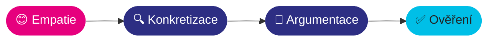

# Připrav se na těžké otázky
---
layout: default
---
# Připrav se na těžké otázky

Na námitky vždy odpověz:

```mermaid
graph LR
    A([😊 Empatie]) --> B([🔍 Konkretizace]) --> C([💬 Argumentace]) --> D([✅ Ověření])
    style A fill:#E6007E,stroke:none,color:#fff
    style B fill:#2D2E83,stroke:none,color:#fff
    style C fill:#2D2E83,stroke:none,color:#fff
    style D fill:#00BFE7,stroke:none,color:#222
```
